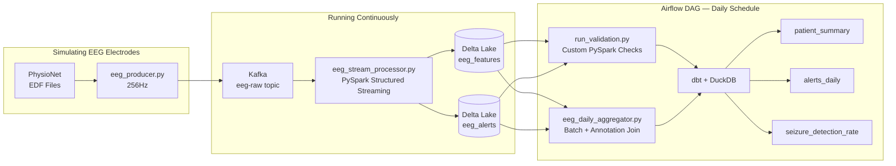

# Seizure Detection EEG

A real-time EEG seizure detection pipeline using Kafka, Spark, and Delta Lake.

> NOTE: THIS REPO WOULD NOT WORK IF U R USING WINDOWS OR MAC!! I'm running Airflow natively in the venv, and my machine is Linux-based. Airflow does not support running pip on Windows or Mac. My future plans is to containerise Airflow but it would be slightly challenging and idw anything to break for now. Scroll to the end for pre-requisites.

Epileptic seizures can occur without warning and require immediate response. Hospital patients are monitored 24/7 via EEG electrodes, but nurses 
cannot watch every patient simultaneously!! Therefore, some kind of real-time monitoring system that is fault-tolerant enough to handle 256 data packets per patient per second and automatically alert clinical staff when a seizure is detected.
!

This project simulates that monitoring infrastructure as an end-to-end data pipeline. A producer simulates EEG electrode readings that fires time-series data at 256Hz, publishing to Kafka. PySpark Structured Streaming consumes the data via micro-batching (near real-time), computes windowed statistics per EEG channel, and writes the results to Delta Lake. A threshold-based detection flags the windows where spike count or variance exceeds a limit, writing seizure events to an alerts table in real time. The dataset used here is the CHBMIT Physionet data set.

## Brief Architectural Overview

### Why these tools
| Tool | Why |
|---|---|
| **Apache Kafka** | Message broker for high-throughput, ordered, fault-tolerant streaming, especially for such frequent, time-series data. Decouples the producer from the consumer so either can fail or restart independently without data loss. |
| **PySpark Structured Streaming** | Handles micro-batch processing at scale with native support for windowed aggregations over time-series data. Chosen over Flink for simpler Python integration.|
| **Delta Lake** | Adds ACID transactions, schema enforcement, and time travel on top of Parquet files. Chosen over raw Parquet because Delta's transaction log means partial writes from a crashed streaming job don't corrupt the table.|
| **dbt + DuckDB** | dbt provides a clean transformation and serving layer with built-in data lineage and testing. DuckDB is used as the query engine because it reads Delta files directly via `delta_scan()`, nonid to set up server, no running Spark session needed for analytics. Well suited for local analytical workloads. |
| **Apache Airflow** | Orchestrates the daily batch workflow with dependency management, retry logic, and a visual DAG UI. Chosen over cron because Airflow makes failures and task dependencies easy to spot. |
| **Custom PySpark Validation** | Data quality checks written natively in PySpark, running directly against the Delta tables before the serving layer. Chosen over Great Expectations and Pandera because both have rough edges with PySpark DataFrames. GE requires significant boilerplate and Pandera's PySpark support is limited. A custom approach is transparent, runs in one Spark pass, and is immediately readable. |
| **mne-python** | Standard library in the neuroscience community for reading EDF files. |

## Results
Validated against patient `chb01` from the CHB-MIT dataset, the pipeline detected 1 out of 7 labeled seizures (14% detection rate) with 253 false positives windows.

Pretty horrendous, but kinda expected. EEG signals are extremely noisy, and can be impacted by just simply thinking harder/ being more emotional... so this threshold based detector is not the best. We could make the threshold lower but it will drastically increase the false positive rates, and the alarm will be sounding off al the time.

Therefore, seizures, as we learnt in the CHB-MIT dataset are short and not always characterised by the specific amplitude thresholds chosen.

We should use ML/DL methods such as a trained classfier, even a simple logistic regression, would be significantly better than this threshold. This is just the natural next step.

## How to Run

> Note: the SQL files under dbt/models/staging has hardcoded file paths to the delta tables. Will need to update once I dockerise Airflow.

### 1. Start Kafka
```bash
docker compose up -d
```

### 2. Start the EEG producer (simulates live EEG stream)
Open a new terminal:
```bash
source venv/bin/activate
python producer/eeg_producer.py
```
Leave this running. It will stream EEG data into Kafka at 256Hz.

### 3. Start the PySpark streaming job
Open a new terminal:
```bash
source venv/bin/activate
python streaming/eeg_stream_processor.py
```
Leave this running. It will consume from Kafka and write to Delta Lake continuously.

### 4. Start Airflow
Open two new terminals:
```bash
# Terminal 1
source venv/bin/activate
export AIRFLOW_HOME=./airflow
airflow webserver -p 8080

# Terminal 2
source venv/bin/activate
export AIRFLOW_HOME=./airflow
airflow scheduler
```
Open http://localhost:8080 (admin / admin) and trigger the `eeg_pipeline_dag` manually,
or wait for it to run on its daily schedule.

The DAG runs in sequence:
1. Batch aggregation + seizure annotation join
2. Custom PySpark data validation
3. dbt models (`patient_summary`, `alerts_daily`, `seizure_detection_rate`)
4. dbt tests

---

## Future Work
- **Containerise Airflow** — currently runs via pip on Linux only. The next step is to move the producer, streaming job, and Airflow into Docker containers so the entire pipeline runs with a single `docker compose up` on any machine.
- **ML-based detection** — replace the threshold logic with a trained classifier (e.g. logistic regression or random forest) on frequency-domain features (delta, theta, alpha, beta band power). Even a simple model would significantly reduce the 253 false positives seen with the current approach.
- **Frontend dashboard** — a real-time dashboard (Streamlit or Grafana) showing live alert rates, patient summaries, and flagged seizure windows pulled from the dbt serving layer.


## Prerequisites

> This is if you have never had used PySpark on a project before, you need to download Java and hadoop dependencies.

- Python 3.11
- Java (required for PySpark): `sudo apt install default-jdk`
- Docker and Docker Compose (for Kafka)

> **Windows only:** PySpark requires Hadoop's `winutils.exe` even when not using HDFS.
> 1. Download all the files in `hadoop-3.3.5/bin/` from https://github.com/cdarlint/winutils 
> 2. Place it at `C:\hadoop` (create one urself)
> 3. Set the environment variable: `HADOOP_HOME=C:\hadoop`

## Setup

### 1. Clone the repo
```bash
git clone https://github.com/realestzeyu/seizure-detection-eeg
cd seizure-detection-eeg
```

### 2. Create and activate a virtual environment
```bash
python3.11 -m venv venv
source venv/bin/activate
```

### 3. Install dependencies
```bash
pip install -r requirements.txt
```

### 4. Download the data
This will take a long ass time due to physionet server being completely ass.
```bash
wget -r -N -c -np https://physionet.org/files/chbmit/1.0.0/chb01/ -P data/raw/
```